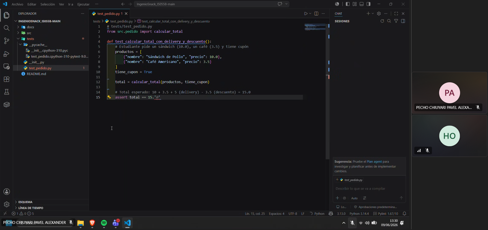
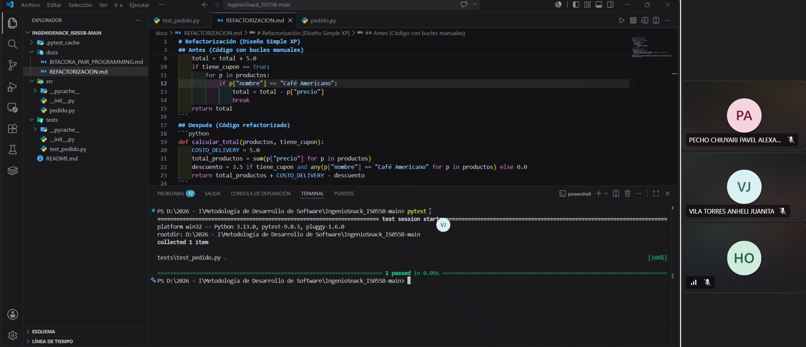

# Bitácora de Programación en Parejas (Pair Programming)

## Sesión 1: Desarrollo Guiado por Pruebas (Ciclo TDD)
* **Fecha y Hora:** 09/06/2026 - 13:30 (Hora Perú)
* **Duración:** 35 minutos
* **Integrantes:** Oscar Hinostroza y Pavel Pecho
* **Roles:** * **Conductor:** Oscar Hinostroza (Escribió el código inicial de `pedido.py` y las pruebas Red-Green).
  * **Navegador:** Pavel Pecho (Revisó la lógica del negocio, dictó las reglas de los S/5.00 de delivery y el descuento del café).
* **Actividad:** Implementación de la función `calcular_total` siguiendo estrictamente TDD para asegurar que el sistema no falle.
* **Evidencia:** 

---

## Sesión 2: Refactorización y Diseño Simple
* **Fecha y Hora:** 09/06/2026 - 14:15 (Hora Perú)
* **Duración:** 30 minutos
* **Integrantes:** Anheli Vila y Oscar Hinostroza
* **Roles:** * **Conductor:** Anheli Vila (Tecleó la refactorización para eliminar los bucles `for` anidados).
  * **Navegador:** Oscar Hinostroza (Supervisó la legibilidad del código, asegurando el cumplimiento del estándar XP y la correcta implementación de la constante `COSTO_DELIVERY`).
* **Actividad:** Refactorización del código de cálculo para cumplir con el principio de Diseño Simple, pasando de una estructura compleja a una optimizada.
* **Evidencia:** 